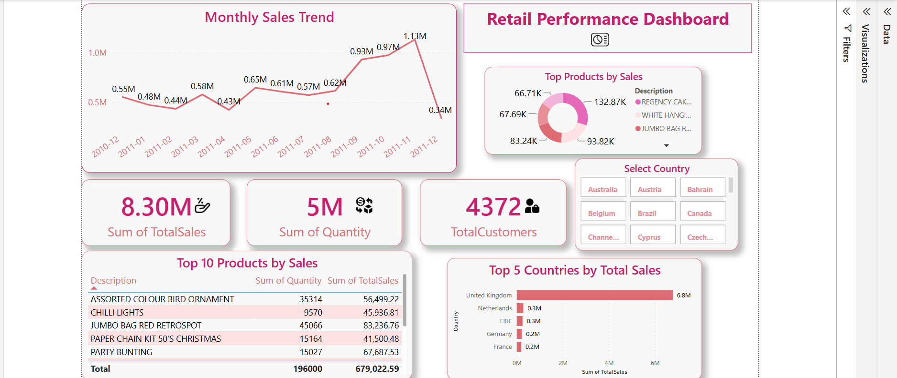

# Online Retail Sales Analysis - Power BI Dashboard 💹

This Power BI dashboard analyzes international online retail data, tracking sales performance across time, countries, and products.

## 📁 Files Included
- `OnlineRetailDashboard.pbix`: Power BI dashboard file
- `dashboard-screenshot.png`: Visual preview of the dashboard

## 📊 Dashboard Highlights
- 📈 Monthly sales trend (2010–2011)
- 💰 Total Sales: 8.30M | Quantity: 5M | Customers: 4372
- 🌍 Top 5 countries by total sales
- 🛍️ Top 10 products by quantity and sales
- 🧾 Interactive filters by country and product
- 🎯 Pie chart of top product categories

## 🛠 Tools Used
- Power BI
- Excel (source data)

## 📷 Dashboard Preview

